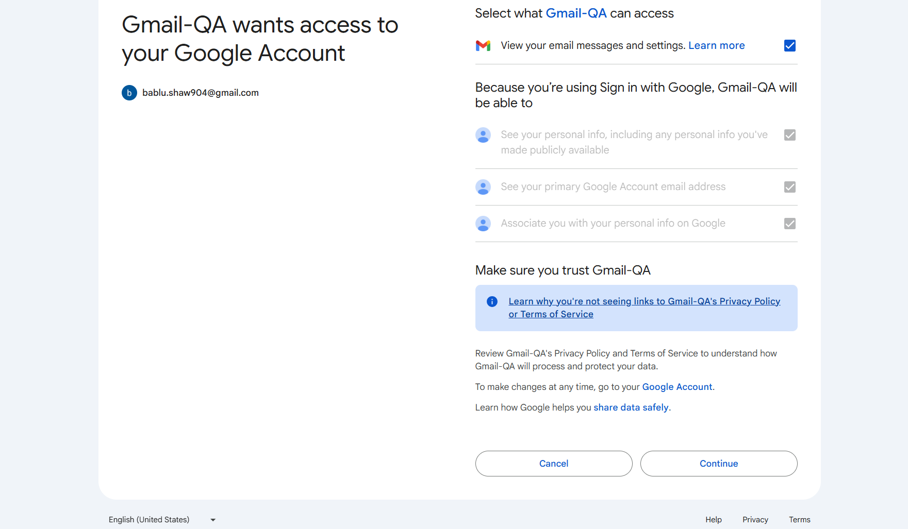

### Gmail OAuth notes
goto: https://console.cloud.google.com/
1. Created project name: GmailQA, id: gmailqa-904
2. Created OAuth 2.0 Client with details:
   a. Client ID: `id`
   b. Client secret: `Secret`
3. Added test user `bablu.shaw904@gmail.com` to enable my login SSO in test
4. While Signing-in to google you will see consent form: 
